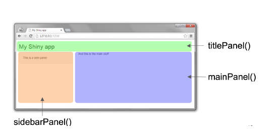

```{r setup, include=FALSE}
knitr::opts_chunk$set(echo = TRUE)
```


## What is shiny?


"shiny" is a package used to create interactive dashboards without the necessity to know any HTML, CSS or JavaScript.

It was developed by Joe Cheng from RStudio.

Some of the benefits of using shiny are:

1. Interactivity.
2. Easy to share.
3. Relatively easy to develop (compared to other programing languages). 
4. Open source library. (RStudio, stackoverflow, github)

## Installing shiny

To install shiny we run:

```{r, eval=FALSE}
install.packages("shiny")
```

and then we load the library:

```{r, eval=FALSE}
library("shiny")
```

## Structure

A folder contating a basic shiny application is structured in two different ways:

1. A folder that contains a file named myapp.R which includes the ui and server functions:

```
myapp
│   app.R
└───data
│   └───data.csv
└───images
    └───image.jpg
```

2. A folder that includes a ui.R and a server.R files:

```
myapp
│   ui.R
│   server.R  
└───data
│   └───data.csv
└───images
    └───image.jpg
```

## What is a ui and a server?

The ui stands for **user interface** and it is the skeleton or layout of an application, for example, where a dropdown menu should be located, or which options a radio button menu should have, or the range of a slidebar. The ui is written using shiny functions and its output is raw HTML code.

The server is a function that allows users interact with the application by selecting specific options of the ui in order to obtain different results which can be in the form of plots, datasets, mathematical calculations, words, images. 

The UI is responsible for creating specific controls that a user can iteract with, while the server is translating the specific options selected in the ui into an actual plot or data.

## Layout of a shiny application



## Basic widgets in Shiny


## Examples

Now let's explore some of the examples that one can create using shiny:

```{r, eval=FALSE}
library(shiny)
runExample("01_hello")
runExample("03_reactivity")
runExample("05_sliders")
runExample("09_upload")
```


## Creating a shiny application

Steps:

1. Have an idea on which data we want to use and how we want to present it.
2. Get the data (webscraping, accesing a database).
3. Clean the data.
4. Create a shiny application.
5. Share the application.
6. Listen to suggestions from users.
7. Improve the application.

## 1) Idea:

We will create a dashboard that visualizes GDP figures at the national level for all published NAICS (North American Industry Classification) industries.

Table 3610043401:
Gross domestic product (GDP) at basic prices, by industry, monthly (x 1,000,000)
https://www150.statcan.gc.ca/t1/tbl1/en/tv.action?pid=3610043401

## 2) Getting the data:

```{r, eval=FALSE}

library(CANSIM2R)

# We will download Table 36-10-0434-01:
# Gross domestic product (GDP) at basic prices, by industry, monthly (x 1,000,000)
# From Statistics Canada

gdp_raw <- getCANSIM(36100434, raw=TRUE)

```
## 3) Cleaning the data:
```{r, eval=FALSE}

library(dplyr)

# Print the first rows of the dataset
head(gdp_raw)


# Verify how many unique variables exist in a given colum name 
unique(table04$Seasonal.adjustment)

unique(table04$Prices)

unique(table04$GEO)

# Cleaning the data:
gdp <- gdp_raw %>% 
  filter(Seasonal.adjustment %in% "Seasonally adjusted at annual rates")%>%
  select("time"="X.U.FEFF.REF_DATE",
         "naics"="North.American.Industry.Classification.System..NAICS.",
         "value"="VALUE", 
         "prices"="Prices") 

# Creating a new column time1 which will be a "date" object.
gdp$time1<-as.Date(paste((gdp$time), "-01", sep=""))

gdp$time1<-as.Date(gdp$time1)


typeof(gdp$value)

```


```{r, eval=FALSE}
# Define UI for app that analyzes the GDP at the national level for all NAICS industries ----

ui <- fluidPage(
  
  # App title ----
  titlePanel("GDP Analysis"),
  
  # Sidebar layout with input and output definitions ----
  sidebarLayout(
    
    # Sidebar panel for inputs ----
    sidebarPanel(
      
    ),
    
    # Main panel for displaying outputs ----
    mainPanel(
      
    )
  )
)

# Define a server function  ----
server <- function(input, output) {
  
  })
  
}

# To run the app:

# shinyApp(ui=ui, server=server)
```

## 4) Creating the shiny application:


```{r, eval=FALSE}
# Define UI for app that analyzes the GDP at the national level for all NAICS industries ----

ui <- fluidPage(
  
  # App title ----
  titlePanel("GDP Analysis"),
  
  # Sidebar layout with input and output definitions ----
  sidebarLayout(
    
    # Sidebar panel for inputs ----
    sidebarPanel(
      
      # Input: selectInput allows users to choose a given industry ----
      selectInput(inputId = "industry",
                  label = "Select an industry:",
                  choices = unique(gdp$naics)), 
      
      # Input: radioButtons allows users to choose a specific price measure ----
      radioButtons(inputId = "prices",
                   label = "Select price measure:",
                   choices = unique(gdp$prices))
      
    ),
    
    # Main panel for displaying outputs ----
    mainPanel(
      
      # Output: Plot ----
      plotOutput(outputId = "plot2", height = "800px", width = "700px")
      
      
    )
  )
)

# Define server logic required to draw a histogram ----
server <- function(input, output) {
  

  # Plot of the monthly GDP ----
  # After users choose a:
  # - specific industry in the dropdown menu
  # - specific price measurement
  # 
  # The server will generate a line chart which is wrapped in a call
  # to renderPlot to indicate that:
  #
  # 1. It is "reactive" and therefore should be automatically
  #    re-executed when inputs (input$industry and input$price) change
  # 2. Its output type is a plot
  
  
  output$plot2 <- renderPlot({
    
    dat <- gdp %>%
      filter(naics %in% input$industry ) %>%
      filter(prices %in% input$prices)
    
    ggplot(dat, aes(x= time1 , y= value, group=1))+
      geom_line()+
      theme(axis.text.x = element_text(size=11, angle=90))+
      scale_x_date(date_labels = "%b %y", date_breaks = "1 year")

  })
  
}

# To run the app:

# shinyApp(ui=ui, server=server)
```

## 5) Sharing the application:

- shinyapps.io
- Ocean Digital
- Amazon Web Services
- Microsoft Azure


